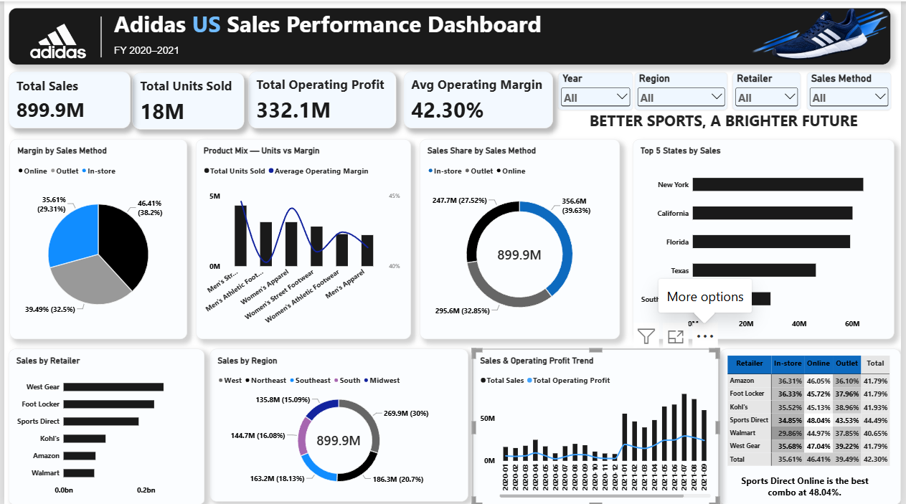

# 👟 Adidas US Sales Performance Dashboard (Power BI)

An interactive **Power BI dashboard** analysing Adidas US sales for **FY 2020–2021** across retailers, regions, states, products and sales channels. It is designed so a VP can understand the business at a glance, on a single screen.



---

## 🎯 Business Questions

- How much did Adidas sell, and how profitable was it overall?
- How did sales and operating profit trend month by month across 2020–2021?
- Which retailers, regions and states drive the most sales?
- Is the best-selling product also the most profitable?
- Which sales channel (In-store, Online, Outlet) earns the best margin?
- Which retailer and sales-method combination performs best?

---

## 📁 Repository Structure

```
Adidas-US-Sales-Dashboard-PowerBI/
│
├── README.md
├── Adidas_US_Sales_Raw.xlsx          # Original dataset
├── Adidas_US_Sales_Cleaned.xlsx      # Cleaned dataset used in the dashboard
├── Adidas_US_Sales_Dashboard.pbix    # Power BI report file
└── dashboard_preview.png             # Dashboard screenshot
```

---

## 🗂️ Dataset

- **Records:** 9,644 sales transactions, 1 Jan 2020 to 31 Dec 2021
- **Table name in Power BI:** `Data Sales Adidas`
- **Columns:** `Retailer`, `Retailer ID`, `Invoice Date`, `Region`, `State`, `City`, `Product`, `Price per Unit`, `Units Sold`, `Operating Profit`, `Operating Margin`, `Sales Method`
- **Retailers:** Foot Locker, West Gear, Sports Direct, Kohl's, Amazon, Walmart
- **Products (6):** Men's and Women's Street Footwear, Athletic Footwear and Apparel
- **Sales methods:** In-store, Online, Outlet

---

## 🧹 Data Preparation

1. **Audited the raw file:** 9,644 rows, no missing values and no duplicate rows.
2. **Standardised regions:** moved the 41 New Mexico records from "Southwest" to "West", leaving five regions (West, Northeast, Southeast, South, Midwest).
3. **Added a `Retailer Key`** column (numeric ID 1–6 per retailer) using an Excel IF formula.
4. **Removed an empty trailing column.**
5. **Loaded the cleaned sheet into Power BI** (table `Data Sales Adidas`) through Power Query and checked data types (dates as Date, prices, units and profit as numbers).
6. **Created a `DateTable`** in DAX and linked it to `Invoice Date` (one-to-many, DateTable on the 1 side).

Both the raw and cleaned files are included so the changes can be checked.

---

## 📐 KPIs & DAX

| KPI | Value |
|---|---|
| Total Sales | **$899.9M** |
| Total Units Sold | **~18M** |
| Total Operating Profit | **$332.1M** |
| Average Operating Margin | **42.30%** |

**Date table:**

```DAX
DateTable =
ADDCOLUMNS(
    CALENDAR(
        MIN('Data Sales Adidas'[Invoice Date]),
        MAX('Data Sales Adidas'[Invoice Date])
    ),
    "Year", YEAR([Date]),
    "Month Number", MONTH([Date]),
    "Month", FORMAT([Date], "MMM"),
    "Year Month", FORMAT([Date], "YYYY-MM"),
    "Quarter", "Q" & FORMAT([Date], "Q")
)
```

**Measures:**

```DAX
Total Sales =
SUMX('Data Sales Adidas', 'Data Sales Adidas'[Price per Unit] * 'Data Sales Adidas'[Units Sold])

Total Units Sold = SUM('Data Sales Adidas'[Units Sold])

Total Operating Profit = SUM('Data Sales Adidas'[Operating Profit])

Average Operating Margin = AVERAGE('Data Sales Adidas'[Operating Margin])
```

> **Note:** Average Operating Margin (42.30%) is the simple average of every row's margin. Dividing total operating profit by total sales gives about 36.9%, which is a different measure.

---

## 📊 Dashboard Visuals

| Visual | Fields | Answers |
|---|---|---|
| 4 KPI Cards | Sales, Units, Profit, Avg Margin | Overall performance |
| Sales & Operating Profit Trend (Combo) | `Year Month`, Total Sales, Total Operating Profit | Monthly trend |
| Sales by Retailer (Bar) | `Retailer`, Total Sales | Top retailers |
| Sales by Region (Donut) | `Region`, Total Sales | Regional split |
| Top 5 States by Sales (Bar, Top N filter) | `State`, Total Sales | Best states |
| Product Mix: Units vs Margin (Combo) | `Product`, Units Sold, Avg Margin | Best seller vs profitability |
| Sales Share by Sales Method (Donut) | `Sales Method`, Total Sales | Channel share |
| Margin by Sales Method | `Sales Method`, Avg Margin | Channel profitability |
| Retailer × Sales Method (Matrix heatmap) | `Retailer`, `Sales Method`, Avg Margin | Best and worst combinations |
| Slicers (4) | Year, Region, Retailer, Sales Method | Interactive filtering |

---

## 🔍 Key Insights

1. **Sales grew from $182.1M in 2020 to $717.8M in 2021 (+294%)**, and operating profit grew 324%. The 2021 data has far more transactions (8,342 vs 1,302), so part of this growth reflects more recorded activity.
2. **Monthly sales peaked in July 2021 ($78.3M) and December 2021 ($77.8M).**
3. **West Gear is the top retailer by sales ($243.0M)**, followed by Foot Locker ($220.1M) and Sports Direct ($182.5M). Walmart is lowest ($74.6M).
4. **Sports Direct has the highest average margin (44.49%)** of any retailer, despite ranking third on sales.
5. **The West region leads with $269.9M (30% of sales).** Midwest is lowest at 15%.
6. **The top 5 states are New York ($64.2M), California ($60.2M), Florida ($59.3M), Texas ($46.4M) and South Carolina ($29.3M).**
7. **The best-selling product is also the most profitable:** Men's Street Footwear leads on units (4.3M), total profit ($82.8M) and average margin (44.6%).
8. **In-store has the largest share of sales (39.6%) but the lowest margin (35.6%).** Online has the smallest share (27.5%) but the highest margin (46.4%).
9. **The best combination is Sports Direct + Online (48.04% margin).** The weakest is Walmart + In-store (29.86%).

---

## 💡 Recommendations

- **Grow online sales**, since they earn the highest margin, especially through Sports Direct.
- **Review in-store pricing and costs**, particularly at Walmart, where margins are lowest.
- **Keep investing in Men's Street Footwear**, which combines volume and margin.
- **Learn from Sports Direct's margins** and apply them to the high-volume retailers, West Gear and Foot Locker.

---

## 🛠️ Tools Used

- **Power BI Desktop**: report design, visuals, slicers
- **Power Query**: loading and preparing data
- **DAX**: date table and measures
- **Excel**: data cleaning and source files

---

## ▶️ How to Open This Project

1. Download `Adidas_US_Sales_Dashboard.pbix`
2. Open it in **Power BI Desktop** (free from Microsoft)
3. If the data source shows an error: **Home → Transform data → Data source settings → Change Source**, and point it to `Adidas_US_Sales_Cleaned.xlsx`

---

## 👩‍💻 Author

**Ankita Kumari**

- 🎓 B.Com (Finance) | Aspiring Data Analyst
- 🛠️ Skills: SQL · Excel · Power BI · Data Cleaning
- 🔗 GitHub: [ankita77-ui](https://github.com/ankita77-ui)

⭐ If you found this project useful, feel free to star the repository!
